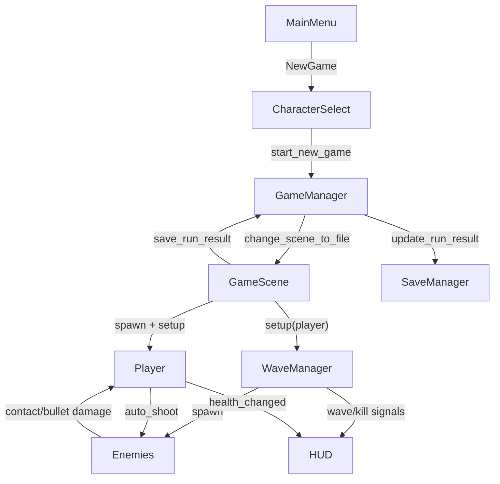

# Developer Guide

本文件面向后续维护和迭代该 Demo 的开发者，重点说明项目结构、核心数据流、常见扩展入口与排障方法。

## 1. 技术栈与约定

- 引擎：Godot 4.x
- 语言：GDScript
- 运行模式：2D 俯视角自动射击波次生存
- 资源策略：无外部美术依赖，运行时像素生成

约定：

- 全局单例统一放在 `scripts/autoload/`
- 场景在 `scenes/`，逻辑脚本在 `scripts/`
- UI 场景在 `scenes/ui/`，UI 脚本在 `scripts/ui/`

## 2. 核心模块职责

### 2.1 全局管理

- `scripts/autoload/game_manager.gd`
  - 管理场景切换：主菜单、角色选择、战斗场景
  - 保存当前角色选择
  - 记录并提交本局结算结果到存档系统

- `scripts/autoload/save_manager.gd`
  - 读写 `user://savegame/save.json`
  - 保持默认字段兼容（防止字段升级导致旧存档崩溃）

### 2.2 战斗场景

- `scripts/game.gd`
  - 生成玩家、初始化波次系统
  - 驱动 HUD（HP/波次/击杀/生存时长）
  - 处理暂停、死亡结算、重开和返回菜单

- `scripts/player.gd`
  - 负责移动、自动索敌、受伤与死亡
  - 从角色配置读取参数：血量、移速、射速、子弹伤害等

- `scripts/weapon.gd`
  - 管理射击冷却和子弹实例化
  - 将运行时参数写入子弹实例

- `scripts/bullet.gd`
  - 负责弹道运动、寿命、命中判定
  - 通过 `hit_player` 区分敌我子弹

### 2.3 敌人与波次

- `scripts/enemy_base.gd`
  - 通用生命系统
  - 接触伤害节流（避免重叠瞬间多次扣血）
  - 通用追踪移动

- `scripts/enemy_melee.gd`
  - 纯追击型敌人

- `scripts/enemy_ranged.gd`
  - 与玩家保持距离并周期射击

- `scripts/wave_manager.gd`
  - 波次推进、敌人生成、难度缩放
  - 发射 `wave_started` / `kill_count_changed` / `wave_cleared` 信号

### 2.4 运行时像素生成

- `scripts/pixel_generator.gd`
  - 用 `Image` 逐像素绘制玩家、敌人、子弹贴图
  - 无需外部 png 资源

## 3. 关键数据流

## 4. 场景树要点

`scenes/game.tscn` 关键节点：

- `Game` (Node2D，挂载 `scripts/game.gd`)
- `WaveManager` (Node2D，挂载 `scripts/wave_manager.gd`)
- `HUD` (CanvasLayer，实例化 `scenes/ui/hud.tscn`)
- `PauseMenu` (CanvasLayer，实例化 `scenes/ui/pause_menu.tscn`)

敌人和玩家都通过 group 参与逻辑：

- 玩家：`players`
- 敌人：`enemies`

## 5. 扩展入口建议

### 5.1 加升级系统（推荐）

接入点：`scripts/game.gd::_on_wave_cleared()`

建议做法：

1. 清场后暂停游戏
2. 弹出升级 UI（3 选 1）
3. 升级项写入玩家或武器参数
4. 关闭 UI，恢复游戏进入下一波

### 5.2 加更多敌人类型

1. 继承 `scripts/enemy_base.gd` 新建脚本
2. 在 `scenes/enemies/` 增加对应场景
3. 在 `scripts/wave_manager.gd` 的 `_start_next_wave()` 加入生成策略

### 5.3 加武器系统（多武器/词条）

当前 `Weapon` 为单实例，建议重构为：

- `Player` 持有 `Array[Weapon]`
- 每把武器独立冷却与弹道参数
- HUD 显示当前 build

## 6. 调参与平衡建议

可优先调整以下参数：

- 角色：`game_manager.gd` 中 `characters` 数组
- 敌人基础：敌人场景中的导出属性（`max_health/speed/contact_damage`）
- 波次强度：`wave_manager.gd`
  - `total_to_spawn`
  - `hp_scale/speed_scale`
  - `intermission_time`

建议策略：

- 先固定玩家参数，再调整波次曲线
- 每次只改一组参数，记录体验差异

## 7. 常见问题与排障

### 7.1 类型推断报错（Warning treated as error）

症状：

- `Cannot infer the type of ...`
- `typed as Variant`

处理：

- 给局部变量显式类型：`var x: float = ...`
- 数值函数使用 `maxf/maxi` 避免 Variant
- 场景实例化后使用 `as Node2D` 等类型收窄

### 7.2 Godot 运行后无窗口或进程立即退出

排查：

1. 检查 `project.godot` 的 `run/main_scene`
2. 打开 Godot 编辑器查看 Output / Debugger
3. 确认脚本是否有 parser error（尤其是类型警告被当错误）

### 7.3 存档异常

排查：

1. 删除 `user://savegame/save.json` 让系统重建
2. 确认 `save_manager.gd` 默认字段是否被破坏
3. 确认 JSON 格式是否合法

## 8. 提交前检查建议

1. 能从主菜单完整进入一局并死亡结算
2. 两个角色都能正常开局，参数差异可感知
3. 两种敌人都能生成并造成伤害
4. 存档统计在主菜单可见并更新
5. 无 parser/lint 错误
