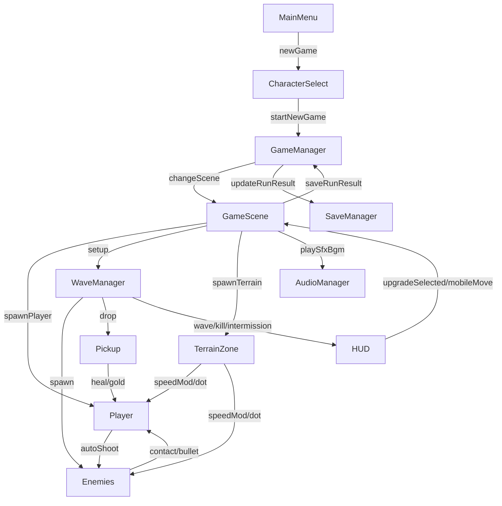

# Developer Guide

本文件面向维护该 Demo 的开发者，覆盖当前版本（含升级系统、地形系统、掉落、Boss、触控与音频）的架构说明与排障建议。

## 1. 技术栈与项目约定

- 引擎：Godot 4.x
- 语言：GDScript
- 类型：2D 俯视角波次生存射击
- 资源策略：优先运行时生成（像素图与合成音），减少外部资源依赖

约定：

- 全局单例放在 `scripts/autoload/`
- 场景在 `scenes/`，逻辑在 `scripts/`
- UI 场景在 `scenes/ui/`，UI 脚本在 `scripts/ui/`
- 大多数跨模块通信走信号（wave/hud/player）

## 2. 核心模块职责

### 2.1 全局管理（autoload）

- `scripts/autoload/game_manager.gd`
  - 场景切换（主菜单/角色选择/战斗）
  - 角色模板数据
  - 本局金币 `run_currency`
  - 最近战绩缓存 `last_run_result`

- `scripts/autoload/save_manager.gd`
  - `user://savegame/save.json` 读写
  - 字段兼容合并（避免老存档缺字段崩溃）
  - 聚合统计：全局最佳、按角色统计、最近战绩、成就

- `scripts/autoload/audio_manager.gd`
  - 运行时合成提示音（射击/受击/击杀/拾取/按钮/波次）
  - 轻量 BGM（菜单与战斗）
  - 后续替换真实音频资源时，优先改这里

### 2.2 战斗核心

- `scripts/game.gd`
  - 生成玩家与地形
  - 挂接波次信号与 HUD 信号
  - 处理升级选择、回合间隔、暂停、结算
  - 触控输入转发到 Player

- `scripts/player.gd`
  - 键盘+触控移动融合
  - 自动索敌与开火
  - 无敌帧/受伤/死亡
  - 升级应用（伤害、射速、穿透、多弹等）
  - 地形减速效果合并

- `scripts/weapon.gd`
  - 冷却射击
  - 扇形扩散（`pellet_count` + `spread_degrees`）
  - 子弹穿透（`bullet_pierce`）

- `scripts/bullet.gd`
  - 子弹寿命与命中
  - 同目标去重命中
  - 穿透后延迟销毁

- `scripts/pickup.gd`
  - 掉落物（金币/治疗）
  - 自动飘动与超时销毁

### 2.3 敌人与波次

- `scripts/enemy_base.gd`
  - 通用生命/接触伤害
  - 地形速度系数（与玩家规则一致）

- `scripts/enemy_melee.gd`：追击型
- `scripts/enemy_ranged.gd`：保持距离并射击
- `scripts/enemy_tank.gd`：高血低速
- `scripts/enemy_boss.gd`：Boss 波扇形弹幕

- `scripts/wave_manager.gd`
  - 波次推进、敌人构成、难度缩放
  - 清场信号、击杀信号、间隔信号
  - 掉落生成（使用 `call_deferred` 避免 physics flushing 报错）
  - 生成规则：边界内随机、避开玩家安全半径、提示后落地

### 2.4 地形系统

- `scripts/terrain_zone.gd`
  - 统一草丛/浅水/深水逻辑
  - 进入时设置速度倍率，离开时清除
  - 深水支持持续伤害（DOT）

- 在 `game.gd::_spawn_terrain_map()` 中使用“簇团式分层生成”：
  - 先铺浅灰可移动地面块（FloorLayer）
  1. 深水（严格占位）
  2. 浅水（与深水互斥）
  3. 障碍物（全图散布，避让所有水域，障碍物间保留间距）
  4. 草丛（允许轻度覆盖，保持自然感）
  - 最后生成四周边界（实体阻挡）

地形冲突矩阵（当前规则）：

| 地形A \\ 地形B | 深水 | 浅水 | 障碍 | 草丛 |
| --- | --- | --- | --- | --- |
| 深水 | 禁止 | 禁止 | 禁止 | 允许轻度 |
| 浅水 | 禁止 | 禁止 | 禁止 | 允许轻度 |
| 障碍 | 禁止 | 禁止 | 禁止 | 允许轻度 |
| 草丛 | 允许轻度 | 允许轻度 | 允许轻度 | 允许 |

说明：

- “障碍全图散布”通过网格 cell + 随机抖动实现，避免只在局部聚堆。
- 可移动地面采用浅灰色棋盘块，提升空间可读性。
- 边界使用与障碍同碰撞层，玩家和敌人均不可越界。

### 2.5 HUD 与菜单

- `scripts/ui/hud.gd`
  - 战斗信息（血量/波次/击杀/时间/金币）
  - 波次倒计时与波次横幅
  - 升级三选一面板（运行时构建）
  - 触控按钮（移动 + 暂停）

- `scripts/ui/main_menu.gd`
  - 显示总统计、最近战绩、成就数量

- `scripts/ui/character_select.gd`
  - 显示角色属性 + 该角色历史战绩

- `scripts/ui/pause_menu.gd`
  - 暂停按钮逻辑
  - Root 设置为 `MOUSE_FILTER_IGNORE`，避免吞掉 HUD 点击

## 3. 当前数据流

## 4. 关键配置项

### 4.1 `game.gd`

- `obstacle_count`：障碍数量
- `grass_count`：草丛数量
- `shallow_water_count`：浅水数量
- `deep_water_count`：深水数量
- `terrain_margin`：生成边界留白
- `placement_attempts`：单块最大尝试次数
- `water_padding`：水域互斥间距
- `obstacle_padding`：障碍物最小间距
- `grass_max_overlap_ratio`：草丛允许覆盖比例上限
- `floor_tile_size`：可移动地面块尺寸
- `floor_color_a / floor_color_b`：可移动地面块配色
- `boundary_thickness`：地图边界厚度
- `boundary_color`：地图边界颜色
- `*_cluster_count`：每类地形簇数量
- `*_cluster_radius`：每类簇半径
- `*_cluster_items`：每簇生成块数量范围
- `_upgrade_pool`：升级候选池

### 4.2 `wave_manager.gd`

- `intermission_time`：波次间隔
- `spawn_min_player_distance`：与玩家的最小出生距离（默认 300）
- `spawn_attempts`：合法出生点采样重试次数
- `spawn_region_margin`：出生区域边界留白
- `telegraph_enabled`：是否启用出生提示
- `telegraph_duration`：提示持续时长
- `telegraph_show_ring`：是否显示警示圈
- `telegraph_show_countdown`：是否显示倒计时
- `tank_scene/boss_scene`：进阶敌人
- `coin_pickup_scene/heal_pickup_scene`：掉落资源
- `telegraph_scene`：出生提示节点场景

### 4.3 `game_manager.gd`

- `characters`：角色模板（含多弹/穿透字段）

### 4.4 `terrain_zone.gd`

- `terrain_type`
- `speed_multiplier`
- `damage_per_tick`
- `damage_interval`

## 5. 常见扩展入口

### 5.1 新增升级项

1. 在 `game.gd::_upgrade_pool` 增加条目
2. 在 `player.gd::apply_upgrade()` 实现对应分支
3. 若需要新 UI 文案，可直接改 `hud.gd::show_upgrade_options()`

### 5.2 新增敌人

1. 继承 `enemy_base.gd`
2. 新建 `scenes/enemies/*.tscn`
3. 在 `wave_manager.gd::_start_next_wave()` 接入生成策略

### 5.3 调整敌人出生规则（无需改代码）

优先调整 `wave_manager.gd` 导出参数：

1. `spawn_min_player_distance`：决定“刷脸”强度
2. `spawn_region_margin`：决定出生点离边界的安全空间
3. `spawn_attempts`：决定严格规则下的稳定性
4. `telegraph_duration`：决定玩家反应窗口
5. `telegraph_show_ring/show_countdown`：决定提示信息密度

### 5.4 新增地形效果

1. `game.gd::_spawn_terrain_map()` 增加生成逻辑
2. `terrain_zone.gd` 添加新效果字段与处理
3. 若是单位侧效果，扩展 Player/Enemy 的 terrain 接口

如果是“只改分布规则不改效果”，优先调整：

1. `terrain_margin`（可通行空间）
2. `*_cluster_count` 和 `*_cluster_radius`（簇团密度与自然感）
3. `water_padding` / `obstacle_padding`（冲突强度）
4. `placement_attempts`（生成成功率）

### 5.5 真音频替换

1. 在 `audio_manager.gd` 中改 `play_*` 实现
2. 可保持对外 API 不变，避免改动调用方

## 6. 常见问题与排障

### 6.1 `Can't change this state while flushing queries`

场景：碰撞回调链中直接 `add_child(Area2D)`  
解决：在 `wave_manager.gd` 使用 `call_deferred("add_child", node)`

### 6.2 `INTEGER_DIVISION` 告警

场景：`int(a / b)` 中 `a`、`b` 都是整型  
解决：改为浮点除法再转整型，如 `int(current_wave / 4.0)`

### 6.3 `SHADOWED_VARIABLE_BASE_CLASS`

场景：参数名与基类属性重名（例如 `visible`）  
解决：重命名参数（如 `show_hint`）

### 6.4 升级按钮点击无效

优先检查：

1. `pause_menu` 的全屏 Root 是否吞输入（应 `MOUSE_FILTER_IGNORE`）
2. 触控容器 `_touch_panel` 是否吞输入（应 `MOUSE_FILTER_IGNORE`）
3. 升级按钮是否因金币不足被 `disabled`

## 7. 验证清单

1. 主菜单可进入新游戏/继续游戏，统计展示正常
2. 角色页能显示按角色战绩
3. 波次推进正常，5 波有 Boss
4. 掉落可拾取（金钱/治疗）且无 flushing 报错
5. 升级面板可点击并进入下一波间隔
6. 地形交互生效（草丛/浅水/深水/障碍）
7. 无 parser/lint 错误
