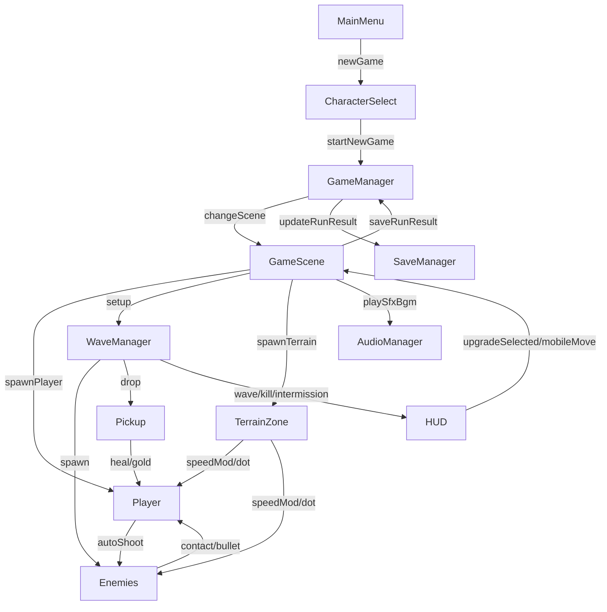

# Developer Guide

本文件面向维护该 Demo 的开发者，覆盖当前版本（含升级系统、地形系统、掉落、Boss、触控与音频）的架构说明与排障建议。按业务流程与功能模块组织的代码索引见 [CODE_INDEX.md](CODE_INDEX.md)。词条完整列表见 [AFFIX_CATALOG.md](AFFIX_CATALOG.md)。

## 1. 技术栈与项目约定

- 引擎：Godot 4.x
- 显示：设计分辨率固定 1280×720，`aspect="keep"` 等比例缩放，多余区域留黑边；`content_scale_size` 固定为设计尺寸；窗口支持 50%/75%/100%/全屏
- 语言：GDScript
- 类型：2D 俯视角波次生存射击
- 资源策略：优先运行时生成（像素图与合成音），减少外部资源依赖

约定：

- 全局单例放在 `scripts/autoload/`
- 场景在 `scenes/`，逻辑在 `scripts/`
- UI 场景在 `scenes/ui/`，UI 脚本在 `scripts/ui/`
- 大多数跨模块通信走信号（wave/hud/player）

## 2. 核心模块职责

### 2.1 全局管理（autoload）

- `scripts/autoload/object_pool.gd`
  - 对象池：对子弹、掉落物等高频实例化对象做池化，减少 instantiate/queue_free 开销
  - `acquire(scene, parent, deferred)`：从池中获取或实例化，加入 parent；deferred=true 时用 call_deferred 避免 physics flushing
  - `recycle(node)`：回收到池；非池化实例则 queue_free
  - `recycle_group(group_name)`：批量回收指定组内可池化节点
  - 池化节点需实现 `reset_for_pool()` 重置状态；bullet/pickup 已支持

- `scripts/autoload/game_manager.gd`
  - 场景切换（主菜单/角色选择/战斗）
  - 角色模板数据
  - 本局金币 `run_currency`（新游戏/继续默认 500）、本局总伤害 `run_total_damage`（结算展示，`add_record_damage_dealt` 记录）、经验值 `run_experience`、等级 `run_level`
  - 本局武器库存 `run_weapons`（每项 `{id, tier, random_affix_ids}`，最多 6 把；手动合成，`merge_run_weapons`）
  - 商店刷新次数 `shop_refresh_count`（新游戏/继续重置）；刷新费用 `get_shop_refresh_cost(wave)`，`try_spend_shop_refresh(wave)` 扣费并 +1
  - 本局已购道具 `run_items`（道具 id 列表）
  - 本局玩家相关升级 `run_upgrades`（每项 `{id, value}`，供词条系统聚合）
  - 本局武器相关升级 `run_weapon_upgrades`（升级 id 列表，同步武器时应用）
  - 武器定义池 `weapon_defs`（近战/远程）
  - 最近战绩缓存 `last_run_result`
  - 设置应用入口（窗口模式/按键映射/敌人血条显隐）

- `scripts/autoload/save_manager.gd`
  - `user://savegame/save.json` 读写
  - 字段兼容合并（避免老存档缺字段崩溃）
  - 聚合统计：全局最佳、按角色统计、最近战绩、成就
  - 设置结构持久化：`settings.system` + `settings.game`

- `scripts/autoload/audio_manager.gd`
  - 运行时合成提示音（射击/受击/击杀/拾取/按钮/波次）
  - 轻量 BGM（菜单与战斗）
  - 后续替换真实音频资源时，优先改这里

- `scripts/autoload/localization_manager.gd`
  - 管理当前语言（`zh-CN` / `en-US`）
  - 从 `i18n/*.json` 读取文案 key
  - 提供 `tr_key(key, params)` 与 `language_changed` 信号

- `scripts/autoload/affix_manager.gd`
  - 词条系统：从 run_items、run_upgrades 收集词条，聚合效果并应用到玩家
  - `collect_affixes_from_player(player)`：按类型分组收集
  - `get_aggregated_effects(affixes)`：按 effect_type 聚合
  - `refresh_player(player)`：收集、聚合、应用
  - `get_visible_affixes(affixes)`：供 UI 展示可见词条
  - `check_combos(affixes)`：预留组合效果扩展点

- `scripts/autoload/log_manager.gd`
  - 将调试器面板的报错与警告输出到 `user://logs/game_errors.log`
  - 捕获 `push_error`、`push_warning`、`printerr`、GDScript 运行时错误
  - 依赖 Godot 4.5+ 的 `OS.add_logger` / `Logger` 接口

### 2.2 战斗核心

- `scripts/game.gd`
  - 生成玩家与地形
  - 挂接波次信号与 HUD 信号
  - 处理升级选择、回合间隔、暂停、结算
  - 处理摄像机缩放按键（`camera_zoom_in`/`camera_zoom_out`）
  - 触控输入转发到 Player
  - 波次开始：玩家传送到地图中心
  - 波次结束：清除剩余敌人（`enemies` 组）与子弹（`bullets` 组）
  - `get_player_for_pause()`：供暂停菜单展示玩家数值
  - 导航系统：`NavigationRegion2D` 子节点，`_spawn_obstacle` 记录 `_obstacle_rects`，`_spawn_terrain_map` 结束后 `call_deferred("_bake_navigation")`；`_bake_navigation()` 使用 `NavigationMeshSourceGeometryData2D` 烘焙可玩区域为可行走区、障碍物为孔洞，供敌人 `NavigationAgent2D` 寻路

- `scripts/player.gd`
  - 键盘+触控移动融合
  - 支持可配置移动惯性（`inertia_factor`）
  - 自动索敌与开火
  - 无敌帧/受伤/死亡
  - 扩展属性：血量上限、魔力上限、护甲、近战/远程伤害加成、血量/魔力恢复、吸血概率（由词条系统聚合）
  - 魔法槽（最多 3 个），按 Q/E/R 释放
  - 升级应用：玩家相关升级走词条系统，武器相关升级传递至每把武器
  - 地形减速效果合并
  - 持有 `CharacterTraitsBase`，通过 `get_final_damage`、`get_elemental_enchantment` 供武器参与数值计算

- `scripts/characters/character_traits_base.gd` 及子类
  - 角色特质基类（Resource），供 Player 持有
  - 子类可重写 `get_damage_multiplier`、`get_elemental_enchantment`、`get_weapon_damage_bonus`、`get_speed_multiplier`、`get_max_health_multiplier`
  - 武器/子弹通过 Player 调用 `get_final_damage` 获取经角色修正后的伤害

- `scripts/weapon.gd`
  - 冷却射击
  - 扇形扩散（`pellet_count` + `spread_degrees`）
  - 子弹穿透（`bullet_pierce`）

- `scripts/bullet.gd`
  - 子弹寿命与命中：玩家子弹用 `life_time` 超时销毁；敌人子弹（`hit_player=true`）出界前不消失，仅当超出可玩区域时销毁
  - 同目标去重命中
  - 穿透后延迟销毁
  - 加入 `bullets` 组，波次结束时 ObjectPool.recycle_group 批量回收
  - 玩家子弹支持 `bullet_type` / `bullet_color` 区分外观与命中反馈
  - 对象池支持：`reset_for_pool()` 清空 `_hit_targets`；命中/超时后 `_recycle_or_free()` 回池

- `scripts/enemy_bullet.gd` + `scenes/enemy_bullet.tscn`
  - 敌人专用子弹：继承 bullet，个头更大（10x10 像素、collision_radius=6）、速度更慢（约 180–190）
  - 使用 `assets/bullets/enemy_bullet.png` 专用像素图
  - enemy_ranged、enemy_boss 使用此场景

- `scripts/pickup.gd`
  - 掉落物（金币/治疗）
  - 金币按价值分级着色（铜/银/金）
  - 金币吸收：玩家进入 `absorb_range` 后飞向玩家并缩小，带动画
  - 自动飘动与超时销毁
  - 对象池支持：`configure_for_spawn(type, value)` 配置类型与纹理；`reset_for_pool()` 重置状态；拾取/超时后 `_recycle_or_free()` 回池

### 2.3 敌人与波次

- `resources/enemy_defs.gd`
  - 敌人定义集中化：36 种敌人（6 原有 + 30 扩展），含 `tier`（normal/elite/boss）、`base_id`、`behavior_mode`、`scene_path`、`name_key`、`desc_key`、`icon_path`
  - 行为模式：`CHASE_DIRECT`(0) 直线追击、`CHASE_NAV`(1) 寻路追击、`KEEP_DISTANCE`(2) 保持距离、`FLANK`(3) 侧翼包抄、`CHARGE`(4) 蓄力冲刺、`BOSS_CUSTOM`(5) Boss 自定义
  - `get_enemy_def(id)`、`get_ids_by_tier(tier)` 供图鉴与生成使用

- `resources/enemy_scene_registry.gd`（Autoload `EnemySceneRegistry`）
  - `id -> PackedScene` 映射，`get_scene(enemy_id)` 供 wave_manager 按 enemy_id 加载场景

- `scripts/enemy_base.gd`
  - 死亡时播放差异化动画（按 `enemy_type`：melee 闪灭缩小、ranged 淡出旋转、tank 碎裂、boss 爆炸、aquatic 水花、dasher 拖尾），动画结束后 emit `died` 并 `queue_free`
  - 通用生命/接触伤害
  - `exp_value`：击败该敌人获得的经验值，各敌人在场景中配置
  - 接触持续伤害：玩家与 HurtArea 重叠时，按 `contact_damage_interval` 持续造成伤害（`_on_contact_timer_timeout` 检查重叠并再次施加）
  - 地形速度系数（与玩家规则一致）
  - `apply_knockback(dir, force)`：受击击退，累加冲击速度并每帧衰减
  - `enemy_id`：若设置则从 EnemyDefs 取 `behavior_mode`，并创建 `NavigationAgent2D`（CHASE_NAV/FLANK/KEEP_DISTANCE 时）
  - 寻路移动：`_move_towards_player_nav`、`_move_away_nav`、`_move_towards_flank_nav` 供不同行为模式使用

- `scripts/enemy_melee.gd`：追击型（支持 CHASE_NAV/FLANK 寻路）
- `scripts/enemy_ranged.gd`：保持距离并射击（KEEP_DISTANCE 时用寻路靠近/远离）
- `scripts/enemy_tank.gd`：高血低速
- `scripts/enemy_boss.gd`：Boss 波扇形弹幕
- `scripts/enemy_aquatic.gd`：水中专属，离水扣血
- `scripts/enemy_dasher.gd`：蓄力冲刺（CHARGE 行为）

- `scripts/wave_manager.gd`
  - 波次推进、敌人构成、难度缩放
  - 清场信号、击杀信号、间隔信号、波次倒计时信号 `wave_countdown_changed`
  - 预生成倒计时：`pre_spawn_countdown`（默认 3 秒）、`start_pre_spawn_countdown()` 由 game 在地形刷新完成后调用；`pre_spawn_countdown_started`、`pre_spawn_countdown_changed` 供 HUD 显示
  - 波次开始流程：emit `wave_started` → game 重置玩家、刷新地图 → 地形完成后调用 `start_pre_spawn_countdown` → 倒计时结束才生成第 1 批敌人
  - `start_next_wave_now()`：跳过间隔，商店点击下一波时调用，立即进入上述流程
  - `wave_duration`：每波最大时长（秒），倒计时归零视为波次结束
  - 波次结束条件：全灭敌人 或 倒计时归零
  - 出生点多人：`spawn_positions_count` 个出生点，单出生点可产生多个敌人，`spawn_telegraph` 显示数量（×N）
  - 掉落生成（使用 `call_deferred` 避免 physics flushing 报错）
  - Boss 额外金币掉落与掉落概率配置
  - 生成规则：边界内随机、避开玩家安全半径、提示后落地

### 2.4 地形系统

- `scripts/terrain_zone.gd`
  - 统一草丛/浅水/深水逻辑
  - 进入时设置速度倍率，离开时清除
  - 深水支持持续伤害（DOT）

- 在 `game.gd::_spawn_terrain_map()` 中使用“簇团式分层生成”：
  - 先铺浅灰可移动地面块（FloorLayer）
  1. 深水（严格占位）
  2. 浅水（与深水互斥）
  3. 障碍物（全图散布，避让所有水域，障碍物间保留间距）
  4. 草丛（严格无重叠，避让水域与障碍）
  - 最后生成四周边界（实体阻挡）
  - **所有地形不得重叠**，各地形间保持配置的 padding 间距

- 每关各地形数量在 `*_count_min` ~ `*_count_max` 范围内随机

- 地形色块统一配置入口：`resources/terrain_colors.tres`，由 `game.gd` 直接引用（`@export var terrain_colors`）

地形冲突规则（严格无重叠）：

| 地形A \\ 地形B | 深水 | 浅水 | 障碍 | 草丛 |
| --- | --- | --- | --- | --- |
| 深水 | 禁止 | 禁止 | 禁止 | 禁止 |
| 浅水 | 禁止 | 禁止 | 禁止 | 禁止 |
| 障碍 | 禁止 | 禁止 | 禁止 | 禁止 |
| 草丛 | 禁止 | 禁止 | 禁止 | 禁止 |

说明：

- “障碍全图散布”通过网格 cell + 随机抖动实现，避免只在局部聚堆。
- 可移动地面采用浅灰色棋盘块，提升空间可读性。
- 边界使用与障碍同碰撞层，玩家和敌人均不可越界。

### 2.5 HUD 与菜单

- `scripts/ui/hud.gd`
  - 战斗信息（血量/魔力条/护甲/经验条/等级/波次/击杀/时间/金币）
  - 魔力条与护甲由 `game.gd` 在 `_process` 中从 player 读取并调用 `set_mana`、`set_armor`
  - HUD 脏检查：`set_mana`、`set_armor`、`set_health`、`set_magic_ui` 等入口在值未变时 early return，减少每帧 StyleBox 重建与 Label 赋值；魔法冷却遮罩按 remaining_cd 变化阈值（0.05s）节流
  - 魔法面板：左下角，横向排列已装备魔法，当前选中绿色边框，独立冷却遮罩；`set_magic_ui(magic_data)` 由 game 每帧传入 `player.get_magic_ui_data()`
  - 多行按键提示：移动、暂停、镜头缩放、魔法、敌人血条（复用 `ResultPanelShared.action_to_text`）
  - 波次倒计时（中上）：预生成/间隔时「第X波-X.Xs」，波次进行中「第X波-剩余Xs」；波次横幅
  - 波次横幅与倒计时文字特效：描边、缩放动画
  - 各模块独立背景（PanelContainer + StyleBoxTexture 程序生成纹理，九宫格拉伸）
  - 升级/商店卡片间距 24、统一基准字号 18
  - 升级四选一面板（可金币刷新，等级越高奖励越多）
  - 商店：TabContainer（商店 / 背包 / 角色信息），Tab 置于底部；商店 Tab 含武器 4 件 + 刷新按钮（刷新费用 1+refresh_count*(1+wave*0.15)）；背包 Tab 打开背包覆盖层；角色信息 Tab 展示 build_player_stats_block(stats_only=true)
  - 商店角色信息 Tab 脏检查：`_update_shop_stats_tab` 对 stats 做轻量哈希，未变时跳过重建
  - 背包覆盖层复用：`game.gd::_show_backpack_from_shop` 关闭时仅 hide，再次打开时 show + set_stats，避免重复 load/new BackpackPanel
  - 升级/商店结算层使用全屏纯色不透明 backdrop
  - 触控按钮（移动 + 暂停）

- `scripts/ui/result_panel_shared.gd`（Autoload）
  - 结算/死亡/通关界面共享 UI 构建逻辑
  - `action_to_text(actions)`：将 InputMap 动作名转为按键字符串，供 HUD、暂停菜单按键提示复用
  - `build_score_block(wave, kills, time, best_wave, best_time, gold?, total_damage?)`：得分区（波次、击杀、时间、金币、总伤害、新纪录标记）
  - `build_player_stats_block(stats, ..., stats_only)`：玩家信息区；`stats_only=true` 时仅构建角色属性区（供暂停菜单属性 Tab）；默认完整展示武器/道具/词条/魔法（供死亡/通关界面）
  - 统一基准字号 `BASE_FONT_SIZE`（18）
  - 供 pause_menu、game_over_screen、victory_screen 复用

- `scripts/ui/game_over_screen.gd` + `scenes/ui/game_over_screen.tscn`
  - 死亡结算界面：CanvasLayer layer=100，全屏遮罩 + 居中 Panel
  - TabContainer（得分 / 背包 / 角色信息），Tab 置于顶部；得分 Tab 含标题、得分区（波次/击杀/时间/金币/总伤害）、返回主菜单；背包 Tab 复用 BackpackPanel（只读）；角色信息 Tab 展示完整玩家信息
  - 接口：`show_result(wave, kills, time, player_node)`

- `scripts/ui/victory_screen.gd` + `scenes/ui/victory_screen.tscn`
  - 通关结算界面：布局与死亡界面一致，TabContainer（得分 / 背包 / 角色信息）
  - 接口：`show_result(wave, kills, time, player_node)`

### 2.6 武器系统

- 角色默认不带攻击，必须装备武器才能输出
- 武器分层：
  - 统一基类：`scripts/weapons/weapon_base.gd`
  - 近战基类：`scripts/weapons/weapon_melee_base.gd`
  - 远程基类：`scripts/weapons/weapon_ranged_base.gd`
  - 具体武器：`scripts/weapons/melee/*.gd` 与 `scripts/weapons/ranged/*.gd`
- 每把武器独立冷却与独立伤害结算
- 近战采用“挥击位移 + 碰触判定”：
  - 仅武器碰触敌人时生效
  - `touch_interval` 按“每把武器 x 每个敌人”独立计时
- 远程子弹从武器节点位置发射，不再固定从玩家中心出生
- 子弹按 `bullet_type` 区分：pistol（手枪 4x4）、shotgun（霰弹 6x6）、rifle（机枪 8x2）、laser（法杖 12x2），颜色取自武器 `color`
- 分类型射击音效：`AudioManager.play_shoot_by_type(type)` 对应不同音高与时长
  - 命中反馈：击退（`enemy_base.apply_knockback`）、命中闪烁（颜色与子弹一致）

### 2.7 词条系统

- 词条附着于武器、魔法、道具，用于限定范围、批量应用效果，使效果与具体物体解耦
- 类层次：`AffixBase`（基类）→ `WeaponAffix`、`MagicAffix`、`ItemAffix`（三子类）
- 词条库：`resources/item_affix_defs.gd`、`weapon_affix_defs.gd`、`magic_affix_defs.gd`，互不干涉
- 物体定义可带 `affix_ids: []`，运行时（商店购买、升级选择）可追加
- 词条分可见/不可见，可见词条在暂停菜单、结算面板展示
- **数值可调节**：词条定义中的 `base_value` 为默认值；绑定时（如 `shop_item_defs` 的 item 中 `base_value`）可指定具体值覆盖，`AffixManager.collect_affixes_from_player` 优先使用绑定值
- **武器词条分类**：`weapon_affix_defs` 中 `weapon_type` 为 `melee` | `ranged` | `both`，供 UI 筛选与展示
- 效果应用流程：`AffixManager.collect_affixes_from_player` → `get_aggregated_effects` → `_apply_affix_aggregated` 写入玩家
- 组合效果扩展：`resources/affix_combo_defs.gd` 配置，`AffixManager.check_combos` 检测
- 武器数值集中配置于：`resources/weapon_defs.gd`，远程武器需配置 `bullet_type`
- 玩家默认最多持有 6 把武器，并在玩家周围显示色块
- **品级系统**：`run_weapons` 每项为 `{id, tier, random_affix_ids}`；手动合成：背包悬浮面板点击「合成」选择素材，`GameManager.merge_run_weapons` 合并；品级越高伤害越高、冷却越短；武器名按品级着色（`resources/tier_config.gd`）
- **武器类型/主题词条**：`weapon_defs` 中每把武器绑定 `type_affix_id`、`theme_affix_id`；2-6 件同类套装生效，线性增长；多把同名武器只计 1 次；`AffixManager.get_set_bonus_effects` 计算并合并到玩家属性
- **商店随机词条**：`_roll_shop_items` 为武器随机附加 0~2 个词条（按 weapon_type 筛选），购买时传入 `add_run_weapon`；`sync_weapons_from_run` 对每把武器应用 `random_affix_ids`
- **攻击速度**：玩家属性 `attack_speed`，系数越高武器冷却越短
- 流程：
  1. 开局默认装备短刃（blade_short）直接开始波次
  2. 每波结算先升级（4 选 1，免费，可金币刷新），再进入商店（武器+道具+魔法，购买后刷新或点下一波）；点击下一波后立即重置玩家、刷新地图、预生成倒计时、生成敌人（无间隔等待）

### 2.7 魔法系统

- `scripts/magic/magic_base.gd`：魔法基类，定义 `cast(caster, target_dir)`（弹道型）与 `cast_at_position(caster, world_pos)`（区域型）接口
- `resources/magic_defs.gd`：魔法定义池（mana_cost、power、element、cast_mode、area_radius、effect_type、cooldown、burn_* 等）
- **cast_mode**：`projectile` 弹道型（按键即释放，方向朝向最近敌人）或 `area` 区域型（进入 targeting 模式，鼠标选点施放）
- **区域施法**：`scripts/ui/magic_targeting_overlay.gd` 显示圆形范围跟随鼠标，左键施放、右键/Esc 取消；冲击波（一次性伤害）、燃烧区域（持续 DOT）
- **施法速度**：玩家属性 `spell_speed`，系数越高魔法冷却越短；升级与道具可提升
- 玩家最多装备 3 个魔法，左右方向键切换当前魔法，E 键施放（cast_magic、magic_prev、magic_next）
- 释放时消耗魔力，弹道型生成弹道命中敌人；区域型在选定位置生成效果
- 魔法可在商店购买

- `scripts/ui/main_menu.gd`
  - 显示总统计、最近战绩、成就数量
  - 设置入口按钮（弹出 `settings_menu`）
  - 图鉴入口按钮（弹出 `encyclopedia_menu`）

- `scripts/ui/encyclopedia_menu.gd`
  - 图鉴菜单：按类型 Tab 展示角色、敌人、道具、武器、魔法、词条及其详细信息
  - 道具 Tab 仅展示 `type!="magic"` 的 ITEM_POOL 项；武器 Tab 内嵌套 TabContainer（近战/远程）；词条 Tab 内嵌套 TabContainer（魔法、道具、武器-通用、武器-近战、武器-远程、武器-类型、武器-主题）
  - 数据来源：GameManager.characters、EnemyDefs、ShopItemDefs、weapon_defs、MagicDefs、各 affix_defs
  - 只读浏览，不修改游戏状态

- `scripts/ui/character_select.gd`
  - 显示角色属性 + 该角色历史战绩

- `scripts/ui/pause_menu.gd`
  - 暂停按钮逻辑
  - TabContainer（系统 / 背包 / 角色信息），Tab 置于底部
  - 系统 Tab：标题、按键提示、继续、主菜单
  - 背包 Tab：`BackpackPanel` 展示装备武器、魔法、道具的图标网格（图标 + 名称，名称按品级着色），悬浮显示背包悬浮面板
  - 角色信息 Tab：调用 `ResultPanelShared.build_player_stats_block(stats, ..., true)` 仅构建角色属性区（HP、魔力、护甲、移速等）
  - 右侧内容区使用 ScrollContainer，内容超出时显示垂直滚动条
  - Root 设置为 `MOUSE_FILTER_IGNORE`，避免吞掉 HUD 点击
  - 暂停层新增全屏纯色不透明 backdrop
  - 面板样式强制不透明，保证暂停文本可读
  - 按键提示：移动、暂停、镜头缩放、魔法、敌人血条（随改键同步）
  - 属性 Tab 仅显示角色属性；死亡/通关界面仍显示完整信息（武器、道具、词条、魔法）

- `scripts/ui/backpack_panel.gd`
  - 背包面板：按武器、魔法、道具分栏展示，每项为带边框的 `BackpackSlot`（图标 + 名称，名称按品级着色）
  - `set_stats(stats)`：根据 `weapon_details`、`magic_details`、`item_ids` 构建三区；脏检查：stats 哈希未变且 shop_context 未变时跳过重建
  - 槽位 StyleBox 复用：`_get_slot_style()` 缓存单例，减少对象分配
  - 图标加载走 `VisualAssetRegistry.get_texture_cached`，缺失时用 `make_color_texture` 生成占位图
  - 悬浮时显示 `BackpackTooltipPopup`，武器/道具用结构化数据（名称、词条 Chip 横向排布、效果），词条可 hover 显示二级详情
  - 道具 tooltip 仅展示最终效果加成，不展示词条与数值；道具名用 `display_name_key`（如疾风靴、恶魔药剂）
  - 武器 tooltip 含「合成」按钮（非最高品级且存在同名同品级其他武器时）；点击后进入合并模式，选择素材完成手动合成
  - `hide_tooltip()`：暂停菜单关闭时调用

- `scripts/ui/backpack_tooltip_popup.gd`
  - 背包悬浮面板：PanelContainer 实现，挂到暂停菜单 CanvasLayer 保证同视口、文字可显示；tooltip 数据轻量哈希（title/weapon_index/affixes/effects）避免 JSON.stringify 开销
  - 词条二级面板：独立 PanelContainer，与主 tooltip 同级（CanvasLayer），首次显示时加入场景树，屏幕坐标定位；AFFIX_TOOLTIP_WIDTH 200、字体 14；完整描述+数值
  - `show_tooltip(text)`：纯文本模式，用于魔法等无词条项；同一物体悬浮移动时不重生成
  - `show_structured_tooltip(data)`：结构化模式，名称 + 词条 Chip 横向排布（可 hover 显示描述与数值）+ 效果；武器可含合成按钮
  - `synthesize_requested(weapon_index)`：合成按钮点击时发出
  - `schedule_hide()`：槽位/面板 mouse_exited 时调用，延迟 0.5s 隐藏，便于鼠标移入 tooltip
  - `is_scheduled_to_hide()`：是否正在延迟关闭（已移除槽位侧阻塞，进入新槽位时取消 hide 并显示）
  - `hide_tooltip()`：关闭提示
  - 词条二级面板：chip 离开后延迟 0.5s 隐藏，鼠标在词条/面板上时均不关闭；主 tooltip mouse_exited 时若鼠标在词条面板上则不调度关闭

- `scripts/ui/backpack_slot.gd`
  - 单个背包槽：VBoxContainer（图标 TextureRect + 名称 Label），名称按品级着色
  - `configure(..., tip_data, weapon_index)`：tip_data 非空时用 `show_structured_tooltip`；weapon_index >= 0 为武器槽
  - `set_merge_selectable(selectable)`：合并模式下置灰不可选或高亮可选
  - `slot_clicked(weapon_index)`：合并模式下点击可选武器槽时发出
  - 进入新槽位时直接显示，show_* 内部会 _cancel_scheduled_hide

- `scripts/ui/settings_menu.gd`
  - 全屏展示布局（与暂停页类似）：Panel 铺满、OuterMargin 边距、CenterContainer 居中内容
  - 系统分页：主音量、分辨率
  - 游戏分页：移动键预设、移动惯性、暂停键、血条切换键、敌人血条开关、暂停提示开关
  - 设置层新增全屏纯色不透明 backdrop
  - 面板样式强制不透明，避免底层画面干扰设置阅读
  - 修改即生效并自动保存

## 3. 当前数据流

### 3.5 数值计算流程

伤害计算由武器发起，经 Player 委托给 CharacterTraits 参与修正：

1. **近战**：`weapon_melee_base._apply_touch_hits()` 若 owner 有 `get_final_damage`，则用其替代武器 `damage`，并获取 `get_elemental_enchantment` 传入 `enemy.take_damage(amount, elemental)`
2. **远程**：`weapon_ranged_base._start_attack()` 若 owner 有 `get_final_damage`，则计算最终伤害并设置到 bullet，同时设置 `elemental_type`
3. **敌人**：`enemy_base.take_damage(amount, elemental)` 的 `elemental` 参数预留抗性/DOT 扩展

### 3.6 玩家受击与伤害缓冲

- **多伤害源取最大**：子弹、接触、地形 DOT 等调用 `player.take_damage(amount)` 时，伤害先缓冲到 `_pending_damages`，帧末取最大值后统一结算，避免同帧多源叠加秒杀
- **无敌帧**：受击后 `invulnerable_duration`（默认 0.5 秒）内不再接受伤害
- **受击音效**：`AudioManager.play_hit()` 使用专用通道，播放中不重叠，避免同帧多次受击时音效堆叠

## 4. 关键配置项

### 4.1 `game.gd`

- `victory_wave`：通关波次（由预设关卡数量决定，标准预设为 10 关），达到该波次时显示通关界面并跳过升级/商店流程
- `grass_count_min` / `grass_count_max`：草丛数量范围（默认 4~9），每关随机
- `shallow_water_count_min` / `shallow_water_count_max`：浅水数量范围（默认 3~6）
- `deep_water_count_min` / `deep_water_count_max`：深水数量范围（默认 2~5）
- `obstacle_count_min` / `obstacle_count_max`：障碍数量范围（默认 4~8）
- `terrain_margin`：生成边界留白
- `placement_attempts`：单块最大尝试次数
- `water_padding`：水域互斥间距（默认 8）
- `obstacle_padding`：障碍物最小间距（默认 10）
- `grass_padding`：草丛与其它地形最小间距（默认 4）
- `floor_tile_size`：可移动地面块尺寸
- `floor_color_a` / `floor_color_b`：可移动地面块配色（fallback，优先用 terrain_colors.tres）
- `boundary_thickness`：地图边界厚度（边界碰撞体不可见，仅保留碰撞）
- `boundary_color`：地图边界颜色（fallback，当前边界无视觉）
- `camera_zoom_scale`：摄像机缩放系数（0.7 更远、1.3 更近，默认 0.6 会在初始化时 clamp 到 0.7～1.3）
- `camera_zoom_min` / `camera_zoom_max`：缩放范围（默认 0.7～1.3）
- `camera_zoom_step`：每次按键变化量（默认 0.05）
- `camera_dead_zone_ratio`：玩家偏离中心超过此比例时摄像机开始跟随（默认 0.30）
- `*_cluster_count`：每类地形簇数量
- `*_cluster_radius`：每类簇半径
- `*_cluster_items`：每簇生成块数量范围
- `_upgrade_pool`：升级候选池

**LevelConfig 地形扩展**（`resources/level_config.gd`）：
- `use_extended_spawn`：启用扩展敌人生成（`normal_enemy_ids`、`elite_enemy_ids`、`boss_enemy_ids` 池，按波次精英概率、Boss 波抽取）；默认 false 时沿用原 `melee_count`/`ranged_count` 等逻辑
- `elite_spawn_chance_base`、`elite_spawn_chance_per_wave`：精英生成概率
- `map_size_scale`：地图大小系数，0.8=小、1.0=中、1.2=大
- `default_terrain_type`：默认地形类型，`flat`=平地、`seaside`=海边、`mountain`=山地；地板瓦片按此选择像素图（terrain_atlas 第 0/1/2 行），默认 `flat`

**摄像机**（`GameCamera2D`）：
- 缩放由 `camera_zoom_scale` 控制，可通过按键 `=`/`-`（`camera_zoom_in`/`camera_zoom_out`）调节
- 当地图大于可视区域时跟随玩家，保持玩家在 `camera_dead_zone_ratio` 死区内
- 敌人生成区域与 `get_playable_bounds()` 对齐

### 4.2 `wave_manager.gd`

- `wave_duration`：每波最大时长（秒），倒计时归零视为波次结束（默认 20）
  - 倒计时每帧扣减的 delta 被限制为最多 0.5 秒，避免首帧或切回标签页时 delta 过大导致波次瞬间结束
- `intermission_time`：波次间隔（当前商店流程已跳过，由 `start_next_wave_now` 直接进入下一波；保留供扩展）
- `pre_spawn_countdown`：预生成倒计时（秒），地形刷新完成后显示，倒计时结束才生成第 1 批敌人（默认 3）
- `spawn_min_player_distance`：与玩家的最小出生距离（默认 340）
- `spawn_positions_count`：出生点数量，单出生点可产生多个敌人（默认 5）
- `spawn_attempts`：合法出生点采样重试次数
- `spawn_region_margin`：出生区域边界留白
- `telegraph_enabled`：是否启用出生提示
- `telegraph_duration`：提示持续时长
- `telegraph_show_ring`：是否显示警示圈
- `telegraph_show_countdown`：是否显示倒计时
- `coin_drop_chance`：金币掉落概率（默认 0.38）
- `heal_drop_chance`：治疗掉落概率（默认 0.17）
- `boss_bonus_coin_count`：Boss 额外掉落金币数量范围（默认 `2~3`）
- `tank_scene/boss_scene`：进阶敌人
- `aquatic_scene`：水中专属敌人，仅在有水域时在水域内生成
- `dasher_scene`：冲刺攻击敌人，波次 ≥ 2 时生成
- `coin_pickup_scene/heal_pickup_scene`：掉落资源
- `telegraph_scene`：出生提示节点场景

### 4.3 `game_manager.gd`

- `characters`：角色模板（含多弹/穿透字段）
- `characters[].traits_path`：角色特质脚本路径，供 Player 加载并参与数值计算
- `weapon_defs`：启动时从 `resources/weapon_defs.gd::WEAPON_DEFS` 载入

### 4.4 `terrain_zone.gd`

- `terrain_type`
- `speed_multiplier`
- `damage_per_tick`
- `damage_interval`
- 水域（`shallow_water`/`deep_water`）时对进入 body 设置 `water_zone_count` meta，供水中敌人 `_is_in_water()` 判断

### 4.5 地形色块统一配置

- `resources/terrain_colors.tres`：地形色块统一入口，含 `floor_a`、`floor_b`、`boundary`、`obstacle`、`grass`、`shallow_water`、`deep_water`
- `resources/terrain_color_config.gd`：Resource 脚本，定义上述颜色字段
- `game.gd` 通过 `@export var terrain_colors` 直接引用，`_get_terrain_color(key, fallback)` 优先从该配置读取

### 4.6 美术资源解耦与独立配置

- 各实现类自行绑定所需美术，不再通过 `VisualAssetRegistry` 集中管理纹理路径
- **Player**：`player.gd` 的 `@export_file texture_sheet`、`texture_single`、`frame_size`、`sheet_columns`、`sheet_rows`
- **Enemies**：`enemy_base.gd` 的 `@export_file texture_sheet`、`texture_single`、`enemy_type`（0=melee, 1=ranged, 2=tank, 3=boss, 4=aquatic, 5=dasher，用于死亡动画与 PixelGenerator 回退），各敌人场景在 Inspector 配置
- **Bullet**：`bullet.gd` 的 `@export_file texture_path`、`@export collision_radius`，武器 def 的 `bullet_texture_path`、`bullet_collision_radius`
- **近战挥击**：`weapon_melee_base.gd` 的 `@export_file swing_texture_path`、`@export swing_frame_size`，weapon_defs 的 `swing_texture_path`
- **武器图标**：weapon_defs 的 `icon_path`，HUD/player 从 option 或 weapon 节点读取
- **掉落物**：`pickup.gd` 的 `@export_file texture_coin`、`texture_heal`
- **升级图标**：`_upgrade_pool` 的 `icon_path`，HUD 从 option 读取
- **VisualAssetRegistry**：`get_texture_cached(path)` 按路径缓存纹理，避免重复 load；`make_color_texture(color, size)` 纯色贴图（同色同尺寸复用缓存）；`make_panel_frame_texture(...)` 生成九宫格面板框纹理

### 4.7 默认地形与像素图

- `resources/default_terrain_colors.gd`：默认地形 3 种配色（flat/seaside/mountain），供 Polygon2D 回退使用
- `terrain_atlas.png`：3 行 x 7 列，第 0/1/2 行分别为 flat、seaside、mountain 地板瓦片
- 使用单层 TileMapLayer（Godot 4.6）：`_terrain_layer` 先铺满默认地形，再覆盖草/水/障碍
- `_spawn_walkable_floor` 优先使用 TileMapLayer 像素图，按 `default_terrain_type` 选择 atlas 行；无 TileMapLayer 时回退 Polygon2D

### 4.8 品级配置

- `resources/tier_config.gd`：品级颜色、伤害倍率、冷却倍率、道具/魔法品级倍率
  - **品级规范**：最多 5 档，从低到高 灰、绿、蓝、金、红（tier 0~4）
  - `get_tier_color(tier)`：0=灰、1=绿、2=蓝、3=金、4=红
  - `get_damage_multiplier(tier)`：1.0 + tier * 0.2
  - `get_cooldown_multiplier(tier)`：1.0 - tier * 0.1，最小 0.5
  - `get_item_tier_multiplier(tier)`：1.0 + tier * 0.15

### 4.9 武器配置

- **武器基础值与成长系数**：`weapon_defs.stats` 为 tier 0（最低品级）的基础值；damage、cooldown、touch_interval 等由 `TierConfig.get_damage_multiplier`、`get_cooldown_multiplier` 计算
- `resources/weapon_defs.gd::WEAPON_DEFS` 字段说明：
  - `id`, `type`, `name_key`, `desc_key`, `cost`, `color`
  - `script_path`（具体武器脚本路径）
  - `icon_path`（武器图标路径，HUD/武器环使用）
  - `swing_texture_path`（近战挥击纹理，仅近战）
  - `bullet_texture_path`、`bullet_collision_radius`（远程子弹，仅远程）
  - `stats`（示例：`damage`, `cooldown`, `range`, `touch_interval`, `swing_duration`, `swing_degrees`, `swing_reach`, `hitbox_radius`, `bullet_speed`, `pellet_count`, `spread_degrees`, `bullet_pierce`）

### 4.10 多语言配置

- 语言文件：
  - `i18n/zh-CN.json`
  - `i18n/en-US.json`
- 存档字段：
  - `save.json.language`
- 入口：
  - 主菜单语言下拉（`main_menu.tscn` + `main_menu.gd`）
- 运行时刷新：
  - 各 UI 监听 `LocalizationManager.language_changed` 并重绘文本

### 4.11 日志与排障

- **内置文件日志**：`project.godot` 中 `[debug]` 启用 `file_logging`，引擎将 `print`、`push_error`、`push_warning` 等输出到 `user://logs/godot.log`
- **统一日志**：`LogManager`（游戏）与 `addons/editor_logger`（编辑器）均写入 `user://logs/game_errors.log`，前缀 `[GAME]` / `[EDITOR]` 区分
- **GDScript::reload 补充**：脚本重载时的解析错误（UNUSED_PARAMETER 等）可能不经过 `OS.add_logger`。EditorLogger 定时从 `godot.log` 与 Output 面板双路中继到 `game_errors.log`，前缀 `[EDITOR][RELAY]` / `[EDITOR][OUTPUT]`
- **插件验证**：启动编辑器后，若 `game_errors.log` 出现 `[EditorLogger] 插件已加载`，说明插件生效；若无，检查「项目 → 项目设置 → 插件」中 Editor Logger 是否启用
- **日志路径**：通过 Godot 菜单「项目 → 打开项目数据文件夹」可找到 `user://` 对应目录，其下 `logs/` 为日志文件

### 4.12 设置结构（SaveManager）

`save.json.settings` 当前结构：

- `settings.system.master_volume`: `0.0~1.0`
- `settings.system.resolution`: 窗口模式 `50%`/`75%`/`100%`/`Fullscreen`（兼容旧格式 `1280x720` 等）
- `settings.game.key_preset`: `wasd/arrows`
- `settings.game.move_inertia`: `0.0~0.9`（角色移动惯性，越大越“滑”）
- `settings.game.pause_key`: 暂停键（字符串）
- `settings.game.toggle_enemy_hp_key`: 敌人血条切换键（字符串）
- `settings.game.show_enemy_health_bar`: 是否显示敌人血条
- `settings.game.show_key_hints_in_pause`: 暂停页是否显示按键提示

## 5. 常见扩展入口

### 5.1 新增升级项

1. 在 `resources/upgrade_defs.gd` 的 `UPGRADE_POOL` 增加条目
2. 玩家相关升级：由词条系统聚合，无需改 `player.gd`；若需新 effect_type，在 `item_affix_defs.gd` 与 `affix_manager._UPGRADE_TO_EFFECT` 中补充
3. 武器相关升级：在 `game.gd::WEAPON_UPGRADE_IDS` 中加入 id，在武器 `apply_upgrade` 中实现
4. 若需要新 UI 文案，在 `i18n/*.json` 与 `hud.gd` 中补充

### 5.1b 新增词条

1. 在对应词条库（`item_affix_defs.gd` / `weapon_affix_defs.gd` / `magic_affix_defs.gd`）增加定义：`id`、`visible`、`effect_type`、`base_value`、`name_key`；武器词条需加 `weapon_type`（`melee` | `ranged` | `both`）
2. 道具：在 `shop_item_defs.gd` 的 item 中增加 `affix_ids: ["xxx"]`；item 的 `base_value` 可覆盖词条默认值
3. 武器/魔法：在 def 中增加 `affix_ids: []`（可选）
4. 若 effect_type 为新类型，在 `player._apply_affix_aggregated` 或对应效果应用处补充处理

### 5.2 新增敌人

1. 在 `resources/enemy_defs.gd` 的 `ENEMY_DEFS` 中新增条目（含 `id`、`tier`、`base_id`、`behavior_mode`、`scene_path`、`name_key`、`desc_key`、`icon_path` 及数值）
2. 在 `resources/enemy_scene_registry.gd` 的 `_scene_paths` 中注册 `id -> scene_path`（若使用自动扫描则无需手动添加）
3. 创建场景 `scenes/enemies/enemy_{id}.tscn`，继承对应基类（melee/ranged/tank/aquatic/dasher/boss），配置 `enemy_id`、纹理
4. 在 `i18n/zh-CN.json`、`i18n/en-US.json` 中新增 `enemy.{id}.name`、`enemy.{id}.desc`
5. 若需自定义逻辑，继承 `enemy_base.gd`
6. 若需水中专属敌人：`is_water_only()` 返回 true，由 `terrain_zone` 维护 `water_zone_count` meta，离水时 `enemy_base` 自动施加伤害
7. 若需自定义出生点（如水中）：在 `get_enemy_spawn_orders` 返回的 order 中设置 `pos_override` 为 `Vector2`；`game.gd` 提供 `get_random_water_spawn_position()`、`has_water_spawn_positions()`

### 5.3 调整敌人出生规则（无需改代码）

优先调整 `wave_manager.gd` 导出参数：

1. `spawn_min_player_distance`：决定“刷脸”强度
2. `spawn_region_margin`：决定出生点离边界的安全空间
3. `spawn_attempts`：决定严格规则下的稳定性
4. `telegraph_duration`：决定玩家反应窗口
5. `telegraph_show_ring/show_countdown`：决定提示信息密度

### 5.4 新增地形效果

1. `game.gd::_spawn_terrain_map()` 增加生成逻辑
2. `terrain_zone.gd` 添加新效果字段与处理
3. 若是单位侧效果，扩展 Player/Enemy 的 terrain 接口
4. 在 `resources/terrain_colors.tres` 中添加新地形色块（若使用 ColorRect 显示）

如果是“只改分布规则不改效果”，优先调整：

1. `terrain_margin`（可通行空间）
2. `*_count_min` / `*_count_max`（每关各地形数量范围）
3. `*_cluster_count` 和 `*_cluster_radius`（簇团密度与自然感）
4. `water_padding` / `obstacle_padding` / `grass_padding`（各地形间最小间距）
4. `placement_attempts`（生成成功率）

### 5.5 真音频替换

1. 在 `audio_manager.gd` 中改 `play_*` 实现
2. 可保持对外 API 不变，避免改动调用方

### 5.6 新增一种语言

1. 在 `i18n/` 下新增语言 JSON（例如 `ja-JP.json`）
2. 在 `localization_manager.gd` 的 `LANGUAGE_FILES` 增加映射
3. 在 JSON 中补齐已有 key
4. 在主菜单下拉中验证切换和回退逻辑

### 5.7 扩展设置项

1. 在 `save_manager.gd` 的 `default_data.settings` 增加字段
2. 在 `settings_menu.gd` 新增控件并在 `_reload_from_save()` 绑定值
3. 在 `_save_and_apply()` 之后由 `game_manager.gd::apply_saved_settings()` 统一应用
4. 若涉及战斗运行时行为，在 `game.gd` 或对应模块监听输入并回写设置（如 `player.set_move_inertia()`）

### 5.8 新增武器

1. 在 `resources/weapon_defs.gd::WEAPON_DEFS` 增加武器定义（含 `script_path`）
2. 若是近战，新增 `scripts/weapons/melee/weapon_*.gd` 并继承 `weapon_melee_base.gd`
3. 若是远程，新增 `scripts/weapons/ranged/weapon_*.gd` 并继承 `weapon_ranged_base.gd`
4. 在 `player.gd::equip_weapon_by_id()` 中验证该脚本可实例化
5. 在 `texture_path_config.gd` 增加 `weapon_{id}` 属性，并在 `texture_paths.tres` 配置图标路径
5. 在 i18n 文件补齐 `weapon.*` 文案 key

### 5.9 新增角色特质

1. 在 `scripts/characters/` 下新增特质脚本，继承 `character_traits_base.gd`
2. 按需重写 `get_damage_multiplier`、`get_elemental_enchantment`、`get_weapon_damage_bonus`、`get_speed_multiplier`、`get_max_health_multiplier`
3. 在 `game_manager.gd::characters` 中为对应角色增加 `traits_path` 字段，指向新脚本路径

## 6. 常见问题与排障

> 每次修复 BUG 后须在 [BUG_LOG.md](BUG_LOG.md) 中记录（现象、原因、修复、预防）。执行 coding 计划前参考 BUG_LOG，避免同类问题。

### 6.1 `Can't change this state while flushing queries`

场景：碰撞回调链中直接 `add_child(Area2D)`  
解决：在 `wave_manager.gd` 使用 `call_deferred("add_child", node)`

### 6.2 `INTEGER_DIVISION` 告警

场景：`int(a / b)` 中 `a`、`b` 都是整型  
解决：改为浮点除法再转整型，如 `int(current_wave / 4.0)`

### 6.3 `SHADOWED_VARIABLE_BASE_CLASS`

场景：参数名与基类属性重名（例如 `visible`）  
解决：重命名参数（如 `show_hint`）

### 6.4 升级按钮点击无效

优先检查：

1. `pause_menu` 的全屏 Root 是否吞输入（应 `MOUSE_FILTER_IGNORE`）
2. 触控容器 `_touch_panel` 是否吞输入（应 `MOUSE_FILTER_IGNORE`）
3. 升级按钮是否因金币不足被 `disabled`

### 6.5 死亡/通关结算界面按钮无效

优先检查：

1. `game_over_screen` / `victory_screen` 使用 `CanvasLayer` layer=100、`process_mode=PROCESS_MODE_ALWAYS`，确保暂停时仍可响应
2. 居中 Panel 与 Backdrop 的 `mouse_filter=STOP`，按钮可点击
3. `game.gd` 中 `_on_player_died()` 调用 `game_over_screen.show_result()`，`_on_wave_cleared()` 在 `wave >= victory_wave` 时调用 `victory_screen.show_result()`

### 6.6 分辨率与等比例缩放

设计分辨率固定 1280×720，窗口调整时强制等比例缩放，多余区域留黑边（letterbox）。  
实现：
1. `project.godot` 使用 `aspect="keep"` 保持比例
2. `game_manager.gd` 中 `_apply_content_scale_to_window()` 将根视口 `content_scale_size` 固定为 1280×720（`DESIGN_VIEWPORT`）
3. `game.gd` 中 `_resize_world_background()` 用 offset 动态设置 WorldBackground 尺寸

## 7. 验证清单

1. 主菜单可进入新游戏/继续游戏，统计展示正常
2. 角色页能显示按角色战绩
3. 波次推进正常，5 波有 Boss
4. 掉落可拾取（金钱/治疗）且无 flushing 报错
5. 升级面板可点击并进入下一波间隔
6. 地形交互生效（草丛/浅水/深水/障碍）
7. 设置菜单可用（音量/分辨率/按键/血条）且重启后保持
8. 暂停页按键提示与改键结果一致
9. 无 parser/lint 错误
